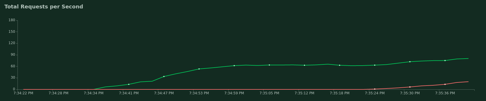

# Banners Assignment

## Assumptions
- impressions are always unique
- a click_id should be unique

## Deployment
Code can be found [here](cloudformation_templates/code_pipeline.yml)

CloudFormation sets up a CodePipeline and a CodeBuild project. CodePipeline makes sure that CodeBuild starts redeploying the whole stack whenever a new `push` happens to the GitHub repository.

CodeBuild uses [this buildspec](codepipeline_buildspec.yml) file to deploy the serverless configuration files.

The serverless configuration files contain everything to deploy the Lambdas, StepFunctions and required resources [1].

[1] The DynamoDB tables are no longer created in [serverless.yml](serverless.yml). I had to empty out all the data in a table, and decided that deleting the entire table would be the best option. The table did not get recreated after new deployments, and I did not want to spend too much time on investigating why that was. 

### Updating the project
Push your changes to GitHub. CodePipeline will make sure that the changes are deployed.

### Deploying the stack
To deploy the Banners-CodePipeline stack, run the following:
```
aws cloudformation create-stack\
 --stack-name Banners-CodePipeline\
 --template-body file://cloudformation_templates/code_pipeline.yml
 --capabilities CAPABILITY_IAM\
 --parameters\
 ParameterKey=OAuthToken,ParameterValue=<A GitHub personal access token> \
 ParameterKey=GitBranch,ParameterValue=<The Git Branch>
```

### Updating the stack
```
aws cloudformation update-stack\
 --stack-name Banners-CodePipeline\
 --template-body file://cloudformation_templates/code_pipeline.yml
 --capabilities CAPABILITY_IAM\
 --parameters\
 ParameterKey=OAuthToken,ParameterValue=<A GitHub personal access token> \
 ParameterKey=GitBranch,ParameterValue=<The Git Branch>
```

## Pipeline

The data pipeline consists of Lambda functions, which are orchestrated using a Step Function. Step Functions and Lambdas are very scalable, since each trigger is processed individually.
The Step Function is invoked whenever a new `.csv` file is put into an S3 bucket.

I'm making use of the Pandas library in the code, since most of the functionality that I need is already implemented in there, and I have limited time. 

### Trigger
Code can be found [here](functions/trigger)

A very simple Lambda function that triggers a StepFunction based on the name of the file that was added to the bucket.

### Deduplication
Code can be found [here](functions/deduplicate)

The `deduplication` step receives the `key` of the file that was added.

Process:
1. The file is loaded into a DataFrame. 
2. The DataFrame is deduplicated. Doing this deduplication, ensures that there will be fewer calls to DynamoDB.
3. The DataFrame is deduplicated using DynamoDB. A DynamoDB table keeps track of which ids have been seen so far. In practice, storing all the ids that have been seen so far is most likely not scalable. I'd only keep the last few hours/ days to check against, since that would already filter out the vast majority of duplicates. Redis could be used instead of DynamoDB as well, but the cost of Redis is much higher than the cost of DynamoDB.
4. Store the deduplicated data back into S3 as a `csv` file. 
5. Return the name of the bucket and the key of the newly stored file.

Flaws:
1. If a function would fail, everything that has been written to DynamoDB did not get stored in the output `csv`. Rerunning the function would flag the records as duplicates. This means that data will be missed.

### Storage / aggregation
Code can be found [here](functions/store)

SQL can be found [here](sql/aggregation.sql)

For storage and aggregation, I'm making use of a PostgreSQL database. PostgreSQL is a transactional database, which means that it is designed for a high amount of transactions. The data will be stored in 3 initial tables:
- clicks. Holds all the deduplicated clicks.
- conversions. Holds all the deduplicated conversions.
- impressions. Holds all the impressions.

Aggregation is also done in PostgreSQL. The records are not updated realtime, but in batches. In this case, I take the 'quarters' of the hour as a batch. In practice, this could happen more frequently in a transaction. 

## Application

SQL can be found [here](app/app.py)

For the application, I'm making use of Lambda functions. I have created a REST API with Serverless and Lambda. Having Lambda functions do the work whenever an API call is made, makes it very scalable.

To get the top performing banners, a call simple query is made against the aggregated table

The query does not follow the business rules exactly, and it makes a dangerous assumption: revenue should not be `null`.
I also haven't implemented that a banner should not be served twice in a row.

The banners are served based on the quarters of an hour. And the banners are shown in a random sequence. 

## Testing
I'm aware that I do not have a lot of tests in my project. My functions are not very complex and mostly make use of functionalities that are provided by other packages. End to end tests would be very interesting, but I haven't had the time to implement those.

### Stresstest
Code can be found [here](stresstest/locustfile.py)




As you can see, the API starts to fail if there is a sustained heavy load on it. The reason behind the failures are Lambdas that time out. The PostgreSQL (db.t2.micro) is not able to cope with such an amount of requests. What could prevent such exceptions:
- Making use of caching
- Making use of DynamoDB instead of PostgreSQL